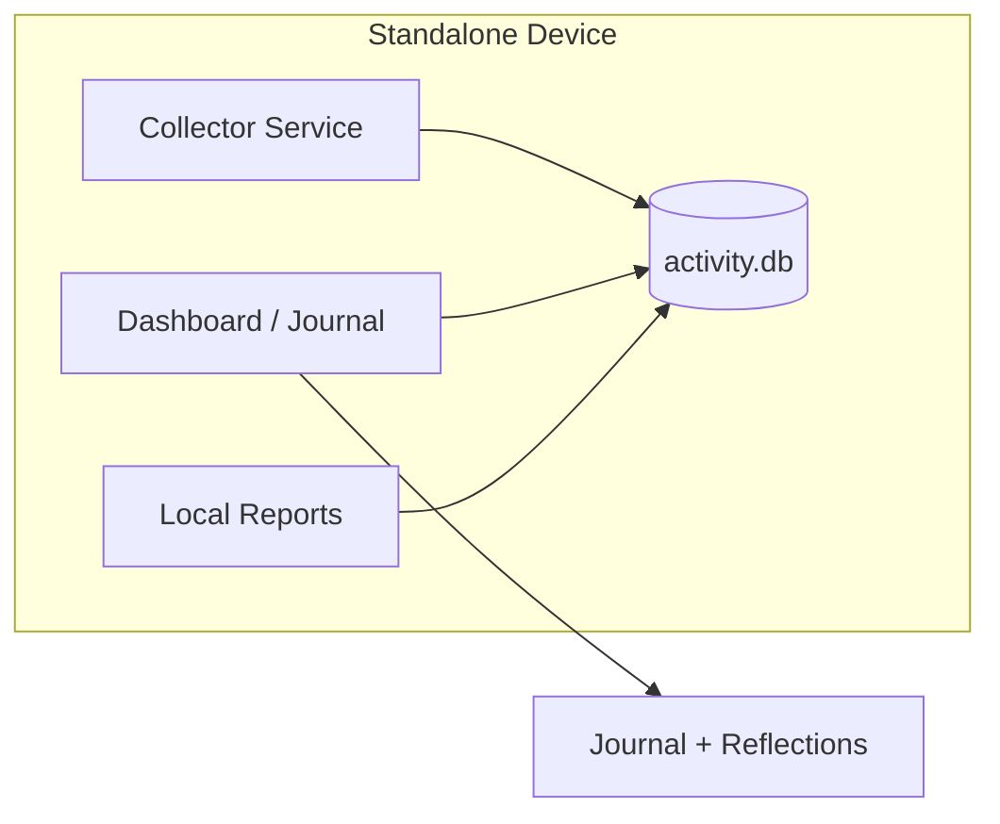
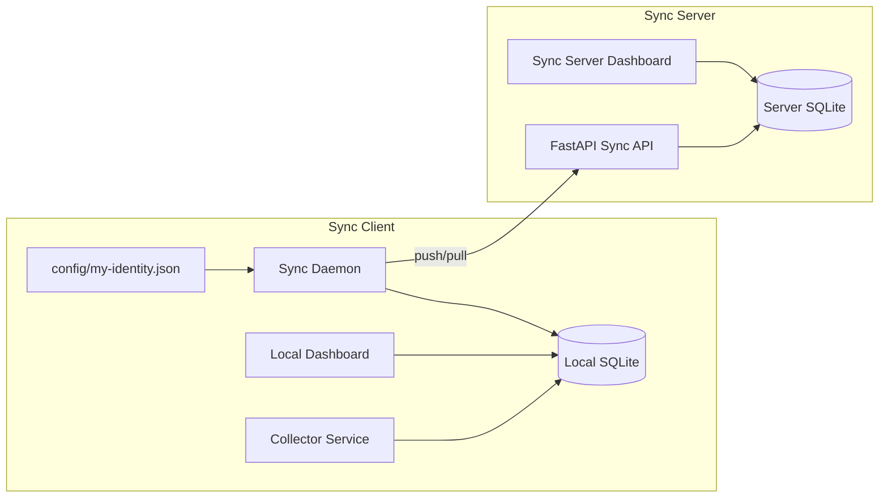
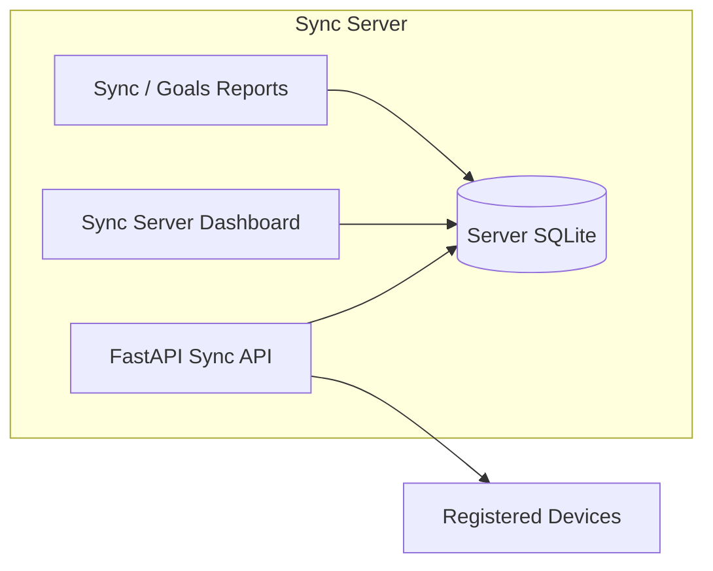
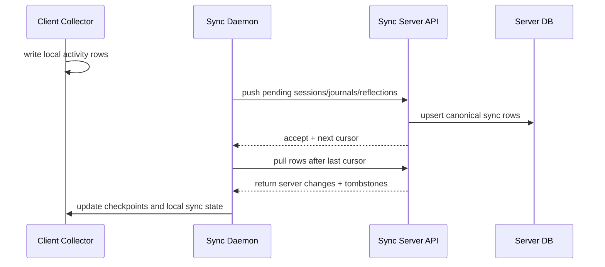

# WorkGraph Operations Guide

This document collects the operational guidance for WorkGraph v1.x stabilization:
architecture diagrams, the sync lifecycle, troubleshooting, deployment, and upgrade steps.

## 1. Standalone Architecture

## 2. Sync-Client Architecture

## 3. Sync-Server Architecture

## 4. Sync Lifecycle

## 5. Troubleshooting Guide

### No data on the dashboard

- Confirm the collector has written to the configured SQLite database.
- Check the dashboard mode in `config/settings.yaml`.
- In sync-server mode, confirm at least one device has registered and pushed data.
- In sync-client mode, confirm `sync_base_url` and `sync_token` are set correctly.

### Sync reports show no devices

- Verify the server database contains `sync_users`, `sync_devices`, and `sync_tokens` rows.
- Check that the device token is active and not revoked.
- Run `workgraph sync validate` against the local database to confirm sync state is intact.

### Backup restore fails

- Use `workgraph backup restore <archive.zip>` for archives created by the CLI.
- The restore path rewrites the main SQLite database and must not be open in another process.
- If SQLite reports a disk I/O error after restore, rerun the restore after closing any active readers.

### Rollups or goal reports look wrong

- Rebuild sync rollups with `POST /api/sync/rollups/rebuild` for the relevant user.
- Confirm `config/goals.yaml` or `config/my-goals.yaml` matches the intended goal allocation.
- Ensure tags are being written to sessions consistently.

### Sync daemon keeps retrying

- Check network connectivity to the sync server.
- Verify the device token and base URL in settings.
- Review recent sync errors on the dashboard or via `GET /api/sync/errors`.

## 6. Deployment Guide

### Local-only standalone deployment

1. Sync dependencies: `uv sync`
2. Start the collector and dashboard: `./run-dashboard.sh` or `uv run python main.py --web --port 4000`
3. Open the dashboard locally and confirm sessions appear in the timeline.

### Sync-client deployment

1. Configure `config/my-settings.yaml` with `dashboard_mode: sync-client`.
2. Set `sync_base_url`, `sync_token`, and `identity_path`.
3. Run `uv run python main.py sync migrate` once.
4. Start the collector and `workgraph sync daemon`.
5. Confirm the client dashboard shows pending state and last sync.

### Sync-server deployment

1. Configure `dashboard_mode: sync-server` on the server host.
2. Start the API with `uv run uvicorn api.app:app --host 0.0.0.0 --port 8000`.
3. Register devices and validate `GET /api/sync/health`.
4. Confirm the dashboard shows device health, queue state, and recent errors.

## 7. Upgrade Guide

### Routine upgrade

1. Pull the latest code.
2. Run `uv sync`.
3. Run `uv run python main.py sync migrate` on every machine that stores local data.
4. For servers, verify the sync dashboard and `/api/sync/health` response.
5. For clients, run one sync cycle and confirm pending counts return to expected values.

### Database backup before upgrade

1. Create a backup: `uv run python main.py backup create`
2. Store the archive somewhere safe.
3. Perform the upgrade.
4. Verify the dashboard, sync health, and timeline views after restart.

### Recovery after a failed upgrade

1. Stop the app processes.
2. Restore the archive: `uv run python main.py backup restore <archive.zip>`
3. Restart the collector, sync daemon, and dashboard.
4. Confirm the restored database opens cleanly and reports match the prior state.
