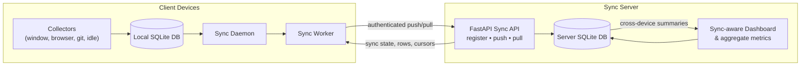

# Sync Docs

This folder contains implementation and operations documents for WorkGraph multi-device sync.

## Sync Architecture

## Documents

- [MULTI_DEVICE_SETUP.md](MULTI_DEVICE_SETUP.md): practical setup steps for Raspberry Pi sync server and multiple client devices.
- [SERVER_AGGREGATE_METRICS_APPROACH.md](SERVER_AGGREGATE_METRICS_APPROACH.md): implemented approach and current behavior for computing dashboard metrics from synced multi-device server data.
- [SYNC_HARDENING_LAUNCH.md](SYNC_HARDENING_LAUNCH.md): implemented hardening summary, resilience guarantees, and pre-launch test checklist.
- [../operations/README.md](../operations/README.md): architecture diagrams, sync lifecycle, troubleshooting, deployment, and upgrade notes.

## Suggested Additions

- `API_CONTRACT.md`: endpoint examples and error model.
- `OPERATIONS.md`: deployment/runbook for Raspberry Pi sync service.
- `TEST_PLAN.md`: integration and load test scenarios.
